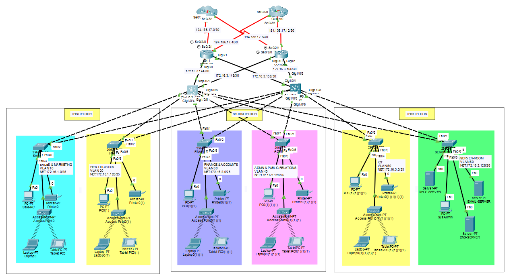
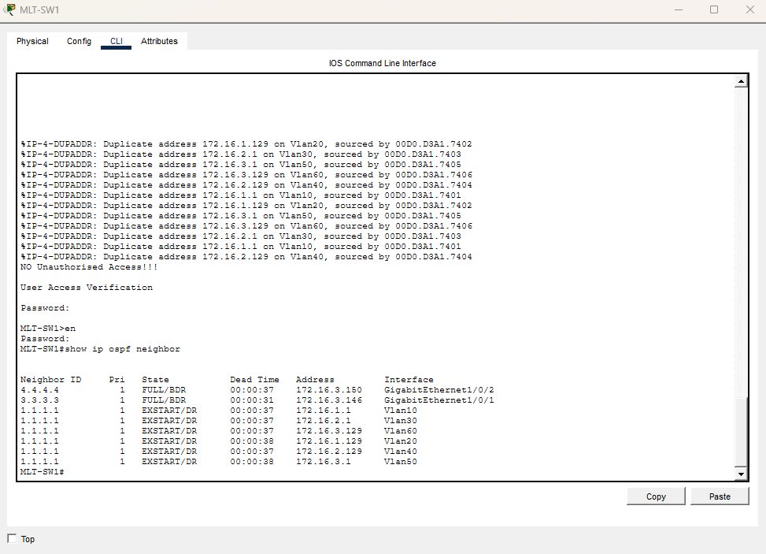
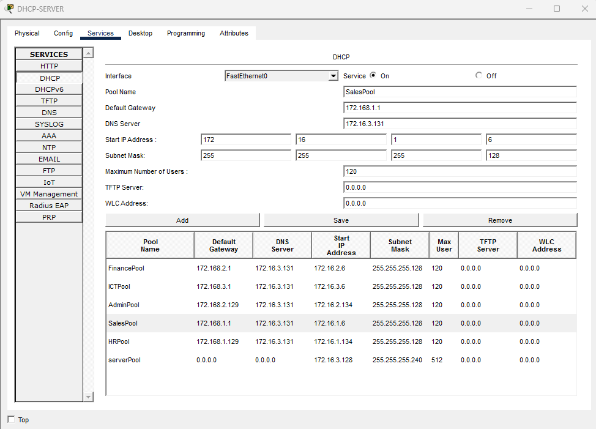
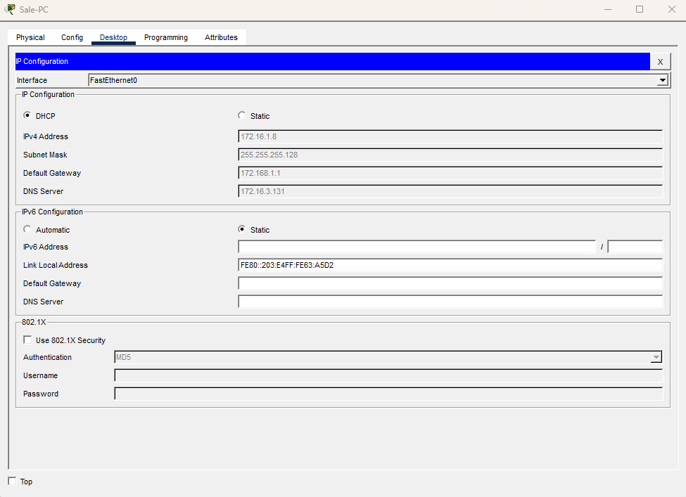
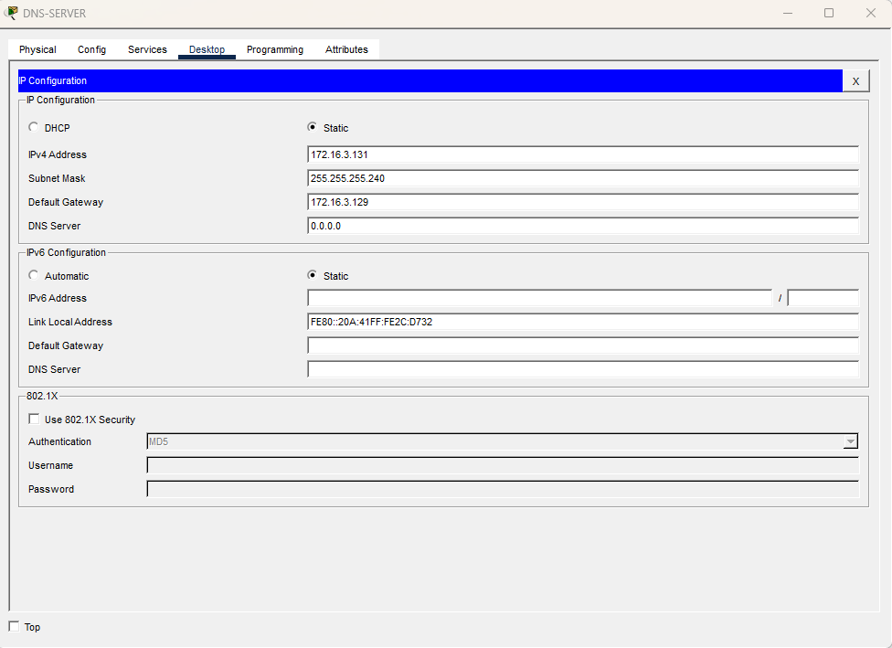
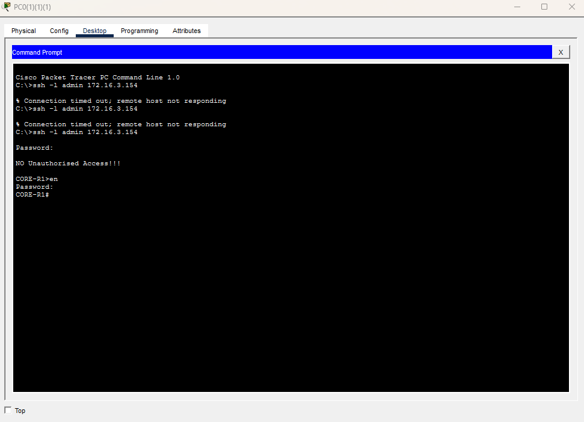
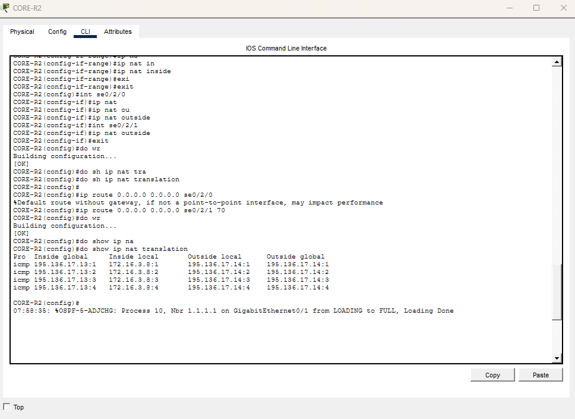
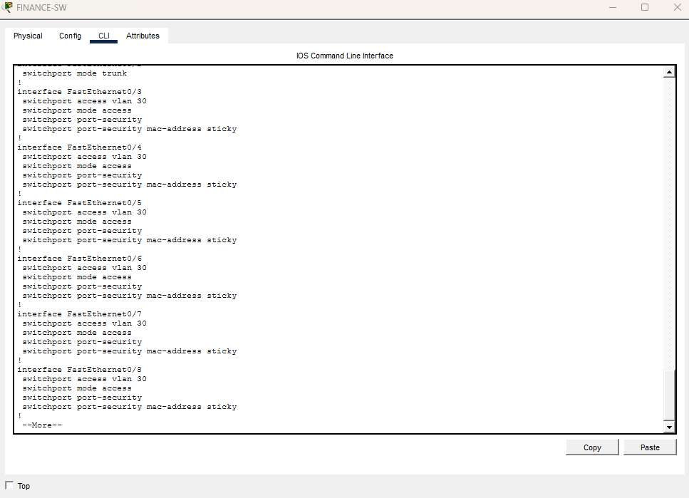
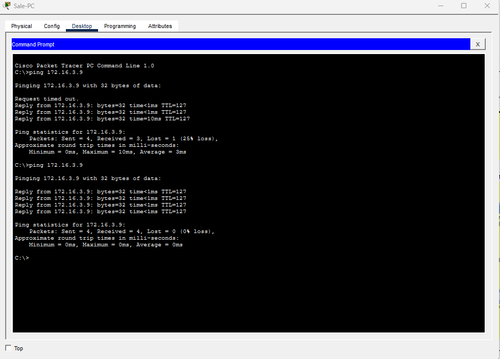

# Company System Network Design

Enterprise network design and implementation for a **Trading Floor Support Centre** supporting approximately **600 users** using **Cisco Packet Tracer**.

The project follows Cisco's **Hierarchical Network Model** and implements redundancy, security, dynamic routing, wireless connectivity, centralized DHCP services, and dual ISP connectivity.

---

# Project Overview

The organization is relocating to a new three-floor building that currently has no existing network infrastructure.

This project presents a scalable, secure, and fault-tolerant network solution designed to satisfy current business requirements while supporting future growth.

### Implemented Features

- Hierarchical Network Architecture
- Redundant Core Layer
- Dual ISP Connectivity
- OSPF Routing
- Inter-VLAN Routing
- DHCP Relay
- Centralized DHCP Server
- SSH Remote Access
- NAT Overload (PAT)
- Port Security
- Wireless Access Points
- VLAN Segmentation
- Access Control Lists
- Server Infrastructure

---

# Network Topology



---

# Building Layout

| Floor        | Department                        | Users | VLAN    | Network         |
| ------------ | --------------------------------- | ----- | ------- | --------------- |
| First Floor  | Sales & Marketing                 | 120   | VLAN 10 | 172.16.1.0/25   |
| First Floor  | HR & Logistics                    | 120   | VLAN 20 | 172.16.1.128/25 |
| Second Floor | Finance & Accounts                | 120   | VLAN 30 | 172.16.2.0/25   |
| Second Floor | Administration & Public Relations | 120   | VLAN 40 | 172.16.2.128/25 |
| Third Floor  | ICT                               | 120   | VLAN 50 | 172.16.3.0/25   |
| Third Floor  | Server Room                       | 12    | VLAN 60 | 172.16.3.128/28 |

---

# Subnet Design

The company provided the address space beginning from **172.16.1.0**.

Variable Length Subnet Masking (**VLSM**) was used to allocate subnets efficiently based on departmental requirements.

## Host Requirements

| Department               | Hosts Required | Prefix | Available Hosts |
| ------------------------ | -------------- | ------ | --------------- |
| Sales & Marketing        | 120            | /25    | 126             |
| HR & Logistics           | 120            | /25    | 126             |
| Finance & Accounts       | 120            | /25    | 126             |
| Admin & Public Relations | 120            | /25    | 126             |
| ICT                      | 120            | /25    | 126             |
| Server Room              | 12             | /28    | 14              |

---

## Departmental Subnets

| VLAN | Department         | Network Address | Prefix | Mask            | Gateway      | Host Range                  | Broadcast    |
| ---- | ------------------ | --------------- | ------ | --------------- | ------------ | --------------------------- | ------------ |
| 10   | Sales & Marketing  | 172.16.1.0      | /25    | 255.255.255.128 | 172.16.1.1   | 172.16.1.1 – 172.16.1.126   | 172.16.1.127 |
| 20   | HR & Logistics     | 172.16.1.128    | /25    | 255.255.255.128 | 172.16.1.129 | 172.16.1.129 – 172.16.1.254 | 172.16.1.255 |
| 30   | Finance & Accounts | 172.16.2.0      | /25    | 255.255.255.128 | 172.16.2.1   | 172.16.2.1 – 172.16.2.126   | 172.16.2.127 |
| 40   | Admin & PR         | 172.16.2.128    | /25    | 255.255.255.128 | 172.16.2.129 | 172.16.2.129 – 172.16.2.254 | 172.16.2.255 |
| 50   | ICT                | 172.16.3.0      | /25    | 255.255.255.128 | 172.16.3.1   | 172.16.3.1 – 172.16.3.126   | 172.16.3.127 |
| 60   | Server Room        | 172.16.3.128    | /28    | 255.255.255.240 | 172.16.3.129 | 172.16.3.129 – 172.16.3.142 | 172.16.3.143 |

---

## Point-to-Point Networks

| Connection        | Network         | Usable Hosts |
| ----------------- | --------------- | ------------ |
| MLT-SW1 ↔ CORE-R1 | 172.16.3.144/30 | 145 – 146    |
| MLT-SW1 ↔ CORE-R2 | 172.16.3.148/30 | 149 – 150    |
| MLT-SW2 ↔ CORE-R1 | 172.16.3.152/30 | 153 – 154    |
| MLT-SW2 ↔ CORE-R2 | 172.16.3.156/30 | 157 – 158    |

---

## ISP Public Addressing

| Connection     | Network          | Router IP     | ISP IP        |
| -------------- | ---------------- | ------------- | ------------- |
| CORE-R1 ↔ ISP1 | 195.136.17.0/30  | 195.136.17.1  | 195.136.17.2  |
| CORE-R1 ↔ ISP2 | 195.136.17.4/30  | 195.136.17.5  | 195.136.17.6  |
| CORE-R2 ↔ ISP1 | 195.136.17.8/30  | 195.136.17.9  | 195.136.17.10 |
| CORE-R2 ↔ ISP2 | 195.136.17.12/30 | 195.136.17.13 | 195.136.17.14 |

---

# Hierarchical Design

## Core Layer

Devices

- CORE-R1
- CORE-R2

Responsibilities

- OSPF Routing
- NAT/PAT
- Internet Connectivity
- Default Routing
- ISP Redundancy

---

## Distribution Layer

Devices

- MLT-SW1
- MLT-SW2

Responsibilities

- Inter-VLAN Routing
- OSPF
- DHCP Relay
- Redundant Links

---

## Access Layer

Devices

- SALE-SW
- HR-SW
- FINANCE-SW
- ADMIN-SW
- ICT-SW
- SERVERROOM-SW

Responsibilities

- End Device Access
- Wireless Connectivity
- VLAN Assignment
- Port Security

---

# Technologies Implemented

- Cisco Packet Tracer
- VLAN Segmentation
- Inter-VLAN Routing
- OSPF
- DHCP Server
- DHCP Relay
- SSH
- NAT Overload
- PAT
- ACL
- Wireless Access Points
- Port Security
- Redundant ISP Connections
- Static Server Addressing

---

# Security Features

## SSH

Configured on:

- CORE-R1
- CORE-R2
- MLT-SW1
- MLT-SW2

Features:

- RSA Key Generation
- Local Authentication
- SSH Version 2

---

## Port Security

Implemented on:

Finance & Accounts Department

Features:

- Sticky MAC Learning
- Maximum 1 Device
- Violation Mode Shutdown

---

## Black Hole VLAN

Unused interfaces assigned to:

```text
VLAN 99
```

Unused ports are administratively disabled.

---

# OSPF Routing

Routing Protocol:

```cisco
router ospf 10
```

Area:

```cisco
Area 0
```

Advertised Networks

- Department VLANs
- Router Interconnections
- ISP Networks

---

# DHCP

Dedicated DHCP Server deployed inside:

**Server Room (VLAN 60)**

DHCP Relay:

```cisco
ip helper-address 172.16.3.130
```

---

# NAT Configuration

PAT configured on Core Routers.

Example:

```cisco
ip nat inside source list 1 interface Serial0/2/0 overload
```

ACL

```cisco
access-list 1 permit 172.16.1.0 0.0.0.127
access-list 1 permit 172.16.1.128 0.0.0.127
access-list 1 permit 172.16.2.0 0.0.0.127
access-list 1 permit 172.16.2.128 0.0.0.127
access-list 1 permit 172.16.3.0 0.0.0.127
access-list 1 permit 172.16.3.128 0.0.0.15
```

---

# Wireless Network

Each department contains:

- Access Point
- Laptop
- Tablet Device

Wireless clients receive addresses dynamically from the centralized DHCP server.

---

# Verification and Testing

## OSPF Neighbor Verification

Successful OSPF adjacency formation.



---

## DHCP Server

Dedicated DHCP pools for all VLANs.



---

## Dynamic IP Allocation

Clients successfully receiving IP addresses.



---

## DNS Server Verification

DNS services hosted inside Server VLAN.



---

## SSH Remote Access

Secure remote administration.



---

## NAT Translation

PAT translation table verification.



---

## Port Security

Sticky MAC verification.



---

## Connectivity Testing

Successful communication between departments.



---

# Validation Checklist

✔ VLAN Segmentation

✔ Inter-VLAN Routing

✔ OSPF Neighbor Formation

✔ DHCP Functionality

✔ Dynamic Address Allocation

✔ SSH Connectivity

✔ NAT Overload

✔ PAT Translation

✔ DNS Resolution

✔ Port Security

✔ Wireless Connectivity

✔ Inter-Department Communication

✔ ISP Redundancy

---

# Repository Structure

```text
company-system-network-design
│
├── README.md
├── company-system-network-design.pkt
│
├── configs
│   ├── ADMIN-SW.txt
│   ├── company-system-network-design.txt
│   ├── CORE-R1.txt
│   ├── CORE-R2.txt
│   ├── FINANCE-SW.txt
│   ├── HR-SW.txt
│   ├── ICT-HR.txt
│   ├── ISP1.txt
│   ├── ISP2.txt
│   ├── MLT-SW1.txt
│   ├── MLT-SW2.txt
│   ├── SALE-SW.txt
│   └── SERVERROOM-SW.txt
│
├── images
│   ├── topology.png
│   ├── ospf-neighbor.png
│   ├── dhcp-server.png
│   ├── dns-server.png
│   ├── ip-from-dhcp.png
│   ├── nat-translation.png
│   ├── ssh-access.png
│   ├── sticky-check.png
│   └── ping-test.png
│
└── docs
```

---

# Software Used

- Cisco Packet Tracer 8.x
- Cisco IOS
- GitHub

---

# Author

**Naiem Hasan**

Network Engineering Student

Cisco Packet Tracer Enterprise Network Design Project

---
